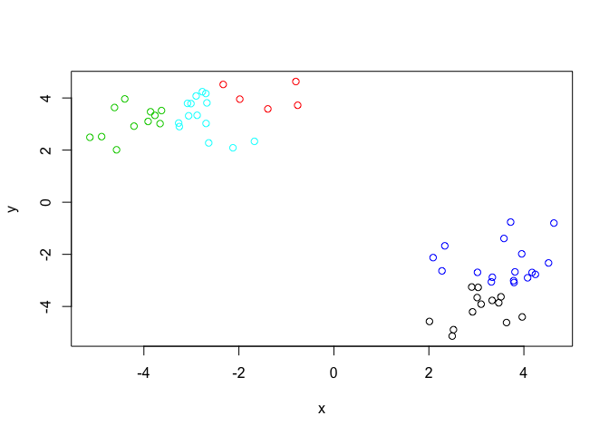
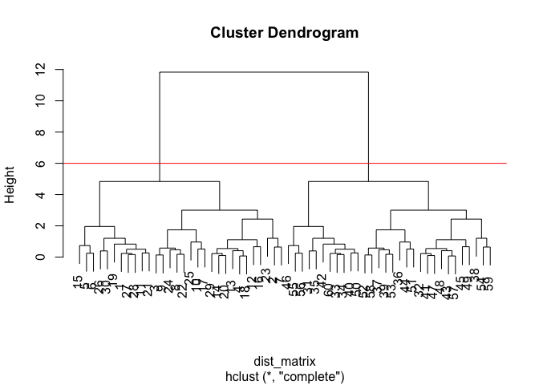

```r
tmp <- c(rnorm(30,-3), rnorm(30,3))
x <- cbind(x=tmp, y=rev(tmp))
#plot(x)
cl <- kmeans(x, centers=5, nstart=20)
plot(x, col = cl$cluster)
```

<!-- -->

```r
dist_matrix <- dist(x) 
hc <- hclust(d = dist_matrix)
plot(hc)
abline(h=6, col="red")
```

<!-- -->

```r
cutree(hc, h=6) 
```

```
##  [1] 1 1 1 1 1 1 1 1 1 1 1 1 1 1 1 1 1 1 1 1 1 1 1 1 1 1 1 1 1 1 2 2 2 2 2
## [36] 2 2 2 2 2 2 2 2 2 2 2 2 2 2 2 2 2 2 2 2 2 2 2 2 2
```


